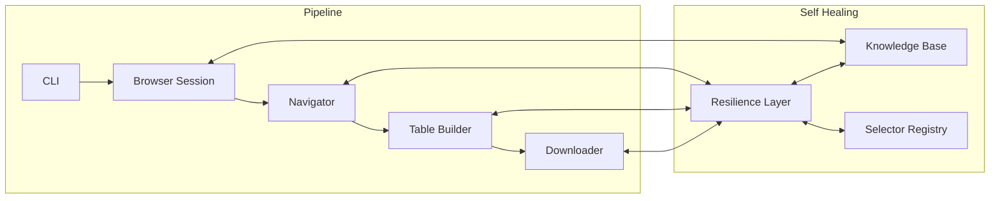

# TableBuilder CLI

Automate ABS TableBuilder to download census data as CSV files via Playwright browser automation.

## Quick Start

1. **Install**:
   ```bash
   uv sync && uv run playwright install chromium
   ```

2. **Configure** credentials:
   ```bash
   mkdir -p ~/.tablebuilder
   cp .env.example ~/.tablebuilder/.env
   # Edit ~/.tablebuilder/.env with your ABS User ID and password
   ```

3. **Fetch** a table:
   ```bash
   uv run tablebuilder fetch \
     --dataset "Census 2021 cultural diversity" \
     --rows "SEXP Sex" \
     -o output.csv
   ```

## Commands

### `tablebuilder fetch`

Download a table from ABS TableBuilder as CSV.

| Option | Description |
|--------|-------------|
| `--dataset` (required) | Dataset name, fuzzy-matched against available datasets |
| `--rows` (required, repeatable) | Variable(s) to place in rows |
| `--cols` (repeatable) | Variable(s) to place in columns |
| `--wafers` (repeatable) | Variable(s) to place in wafers (layers) |
| `-o, --output` | Output CSV path (default: `tablebuilder_YYYYMMDD_HHMMSS.csv`) |
| `--headed` | Show the browser window for debugging |
| `--user-id` | ABS User ID (overrides `.env`) |
| `--password` | ABS password (overrides `.env`) |
| `--timeout` | Queue timeout in seconds (default: 600) |

Example with multiple variables:

```bash
uv run tablebuilder fetch \
  --dataset "Census 2021" \
  --rows "SEXP Sex" \
  --rows "AGEP Age" \
  --cols "STATE" \
  -o cross_tab.csv
```

### `tablebuilder datasets`

List all available datasets in TableBuilder. Requires login credentials.

```bash
uv run tablebuilder datasets
```

### `tablebuilder variables DATASET`

List variables available in a dataset. **Not yet implemented.**

### `tablebuilder doctor`

Show health status, selector diagnostics, and accumulated knowledge.

```bash
uv run tablebuilder doctor
```

### Global Options

| Option | Description |
|--------|-------------|
| `-v, --verbose` | Show debug logging on the console |

## Architecture



| Module | Purpose |
|--------|---------|
| `cli.py` | Click CLI: fetch, datasets, variables, doctor commands |
| `config.py` | Load credentials from `~/.tablebuilder/.env` |
| `models.py` | `Axis` enum, `TableRequest` dataclass |
| `browser.py` | Playwright session management, login, terms acceptance |
| `navigator.py` | Dataset navigation, fuzzy matching, tree expansion |
| `table_builder.py` | Variable selection, axis assignment via JSF form submission |
| `downloader.py` | Queue submission, polling, ZIP download and extraction |
| `selectors.py` | Central registry of 19 CSS and JSF selectors with fallbacks |
| `resilience.py` | `find_element()` with fallback selectors, `@retry` decorator |
| `knowledge.py` | JSON knowledge base accumulating learnings across runs |
| `doctor.py` | Health report: credentials, selectors, timings, quirks |
| `logging_config.py` | Python logging with file + console handlers |

## Self-Healing

The tool recovers from failures through multiple strategies:

**Fallback Selectors**: Each UI element has a primary CSS selector and one or more fallbacks. When ABS changes their UI, the tool automatically tries alternative selectors before failing.

**Knowledge Accumulation**: Every run records what works and what fails in `~/.tablebuilder/knowledge.json`. On the next run, the knowledge base promotes selectors that have been working and deprioritizes those that have failed.

**Retry Logic**: Transient failures (timeouts, network issues) are automatically retried with exponential backoff via the `@retry` decorator.

**Doctor Command**: Run `tablebuilder doctor` to see a health report showing which selectors are using fallbacks, operation timings, and any recorded dataset quirks.

Learnings are stored in `~/.tablebuilder/knowledge.json`. You can inspect this file to see what the tool has learned, or delete it to start fresh.

## Troubleshooting

| Problem | Solution |
|---------|----------|
| "Login failed" | Check credentials in `~/.tablebuilder/.env` |
| "Login timed out" | ABS TableBuilder may be down; try `--headed` to see the browser |
| "No dataset matching" | Use `tablebuilder datasets` to see available names |
| "Table is still empty" | Variable name must match exactly; check spelling |
| "Queue timeout" | Increase with `--timeout 1200`; large tables take longer |
| Selectors breaking | Run `tablebuilder doctor` to see which selectors are using fallbacks |

## Development

```bash
# Run all unit tests
uv run pytest

# Run a specific test file
uv run pytest tests/test_browser.py -v

# Run with verbose output
uv run pytest -v

# Skip integration tests (default in CI)
uv run pytest -m "not integration"

# Run integration tests (requires real ABS credentials)
uv run pytest -m integration
```

## Data Dictionary

See `docs/census_2021_data_dictionary.md` for a Census 2021 variable reference including variable codes, labels, and categories.
