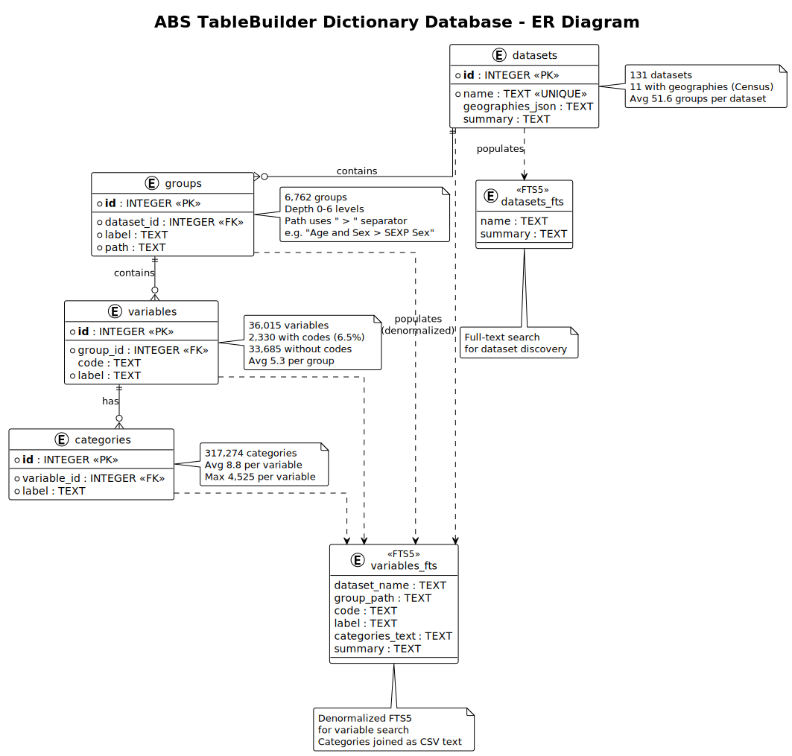
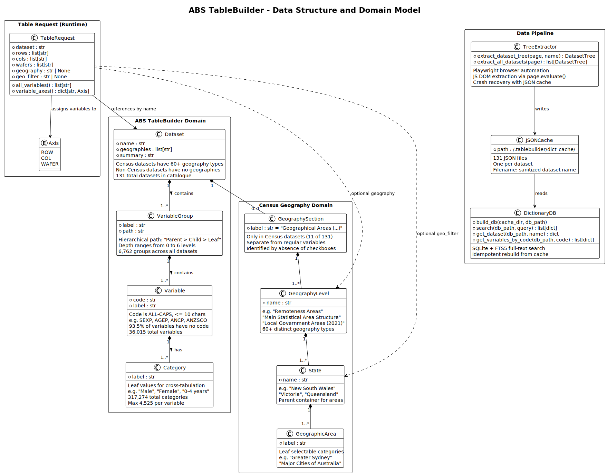

# ABS TableBuilder Dictionary Database - Metadata and Structure

## Overview

The ABS TableBuilder Dictionary Database (`~/.tablebuilder/dictionary.db`) is a 49MB SQLite database containing the complete metadata catalogue of the Australian Bureau of Statistics (ABS) TableBuilder web application. It provides full-text search across all datasets, variables, and categories available on [tablebuilder.abs.gov.au](https://tablebuilder.abs.gov.au).

### Database Statistics

| Metric | Value |
|--------|-------|
| File size | 49 MB |
| Datasets | 131 |
| Groups | 6,762 |
| Variables | 36,015 |
| Categories | 317,274 |
| Datasets with geographies | 11 (Census datasets) |
| Variables with codes | 2,330 (6.5%) |
| Variables without codes | 33,685 (93.5%) |
| Avg groups per dataset | 51.6 |
| Avg variables per group | 5.3 |
| Avg categories per variable | 8.8 |
| Max categories per variable | 4,525 |
| Distinct geography types | 60+ |
| Cache files (source) | 131 JSON files |

---

## Data Pipeline

```
ABS TableBuilder Web UI
        |
        | (Playwright browser automation)
        v
  tree_extractor.py  ──>  ~/.tablebuilder/dict_cache/*.json  (131 JSON files)
        |
        | (dictionary_db.py build_db())
        v
  ~/.tablebuilder/dictionary.db  (SQLite + FTS5)
```

The data flows through three stages:

1. **Extraction**: `tree_extractor.py` uses Playwright to open each dataset in the ABS TableBuilder UI, expand the full variable tree DOM, and extract node metadata via JavaScript evaluation
2. **Caching**: Each dataset's tree is serialized as JSON to `~/.tablebuilder/dict_cache/` for crash recovery and incremental extraction
3. **Loading**: `dictionary_db.py` reads all cached JSON files and loads them into a normalized SQLite schema with FTS5 full-text search indexes

---

## Core Tables (Entity-Relationship)



### Schema DDL

```sql
CREATE TABLE datasets (
    id INTEGER PRIMARY KEY,
    name TEXT UNIQUE NOT NULL,
    geographies_json TEXT DEFAULT '[]',
    summary TEXT DEFAULT ''
);

CREATE TABLE groups (
    id INTEGER PRIMARY KEY,
    dataset_id INTEGER NOT NULL REFERENCES datasets(id),
    label TEXT NOT NULL,
    path TEXT NOT NULL
);

CREATE TABLE variables (
    id INTEGER PRIMARY KEY,
    group_id INTEGER NOT NULL REFERENCES groups(id),
    code TEXT NOT NULL DEFAULT '',
    label TEXT NOT NULL
);

CREATE TABLE categories (
    id INTEGER PRIMARY KEY,
    variable_id INTEGER NOT NULL REFERENCES variables(id),
    label TEXT NOT NULL
);
```

### FTS5 Virtual Tables

```sql
CREATE VIRTUAL TABLE datasets_fts USING fts5(name, summary);

CREATE VIRTUAL TABLE variables_fts USING fts5(
    dataset_name, group_path, code, label, categories_text, summary
);
```

The FTS5 tables are denormalized copies optimized for full-text search. They contain generated summaries and flattened category text for relevance ranking.

---

## Table Descriptions

### `datasets` - ABS Data Collections

Each row represents one ABS TableBuilder dataset (e.g., "2021 Census - counting persons, place of usual residence").

| Column | Type | Description |
|--------|------|-------------|
| `id` | INTEGER PK | Auto-increment identifier |
| `name` | TEXT UNIQUE | Dataset display name from ABS catalogue |
| `geographies_json` | TEXT | JSON array of available geography level names (Census datasets only; `[]` for non-Census) |
| `summary` | TEXT | Auto-generated natural language summary for search |

**Sample rows:**

| name | geographies (count) |
|------|---------------------|
| 2021 Census - counting dwellings, place of enumeration | 60 geography types |
| Disability, Ageing and Carers, 2009 | 0 |
| Employee Earnings and Hours, 2023 | 0 |
| Children enrolled in a preschool program, 2024 | 0 |

### `groups` - Variable Groups (Thematic Sections)

Groups represent the hierarchical folder structure in the ABS variable tree. A group can be nested up to 6 levels deep, with the full path stored as a `>` delimited string.

| Column | Type | Description |
|--------|------|-------------|
| `id` | INTEGER PK | Auto-increment identifier |
| `dataset_id` | INTEGER FK | References `datasets.id` |
| `label` | TEXT | Full hierarchical path label |
| `path` | TEXT | Same as label (used for search indexing) |

**Group depth distribution:**

| Depth | Count | Example |
|-------|-------|---------|
| 0 (top-level) | 481 | `Geographical Areas (Enumeration)` |
| 1 | 1,058 | `Activity Level Data Items > Frequency of Individual Activities` |
| 2 | 1,173 | `Geographical Areas (Enumeration) > Greater Capital City Statistical Areas > New South Wales` |
| 3 | 2,274 | (most common - state-level geographic breakdowns) |
| 4 | 1,101 | |
| 5 | 649 | |
| 6 | 26 | (deepest nesting) |

### `variables` - Statistical Variables

A variable is a classifiable dimension (e.g., "SEXP Sex", "AGEP Age", "Country of Birth"). Variables belong to exactly one group.

| Column | Type | Description |
|--------|------|-------------|
| `id` | INTEGER PK | Auto-increment identifier |
| `group_id` | INTEGER FK | References `groups.id` |
| `code` | TEXT | ABS variable code (e.g., `SEXP`, `AGEP`, `ANCP`); empty string if not coded |
| `label` | TEXT | Human-readable variable name |

**Code parsing rule:** The first word of a variable label is treated as a code if it is ALL-CAPS and <= 10 characters. Otherwise, the entire label is the name and code is empty.

**Top variables by category count:**

| Code | Label | Categories | Dataset |
|------|-------|------------|---------|
| ANZSCO | 4 digit (Unit group) | 364 | Employee Earnings and Hours, 2023 |
| ANCP | Ancestry Multi Response | 322 | 2016 Experimental IHAD |
| MTWP | Method of Travel to Work | 237 | 2016 Experimental IHAD |
| YARP | Year of Arrival in Australia | 120 | 2016 Experimental IHAD |
| AGEP | Age | 116 | 2016 Experimental IHAD |

### `categories` - Variable Categories (Leaf Values)

Categories are the selectable leaf values for each variable (e.g., "Male", "Female" for SEXP Sex).

| Column | Type | Description |
|--------|------|-------------|
| `id` | INTEGER PK | Auto-increment identifier |
| `variable_id` | INTEGER FK | References `variables.id` |
| `label` | TEXT | Category display text |

---

## Largest Datasets by Category Count

| Dataset | Groups | Variables | Categories |
|---------|--------|-----------|------------|
| Administrative Data Snapshot of Population, 30 June 2021 | 12 | 72 | 21,753 |
| 2016 Experimental IHAD - Counting Persons | 33 | 191 | 20,939 |
| 2016 Experimental IHAD - Counting Families | 37 | 163 | 20,125 |
| 2016 Experimental IHAD - Counting Dwellings | 34 | 143 | 19,946 |
| Disability, Ageing and Carers, 2009 | 89 | 1,003 | 7,752 |
| Children enrolled in preschool, 2023 | 117 | 443 | 6,235 |

---

## Census Geography System

Only 11 Census datasets carry geography metadata. These datasets have a special "Geographical Areas" section in their variable tree that is separate from regular statistical variables.

### Geography Types (60+ distinct types)

Geographies fall into these families:

| Family | Examples |
|--------|----------|
| **ASGS Main Structure** | Australia, Main Statistical Area Structure (SA1-SA4), Greater Capital City Statistical Areas |
| **Remoteness** | Remoteness Areas, Remoteness Areas (National) |
| **Administrative** | Local Government Areas (2021/2022/2025 Boundaries), Commonwealth Electoral Divisions, State Electoral Divisions |
| **Indigenous** | Indigenous Structure, Empowered Communities |
| **Other Spatial** | Postal Areas, Suburbs and Localities, Significant Urban Areas, Section of State/Urban Centres and Localities |
| **Environmental** | Australian Drainage Divisions, Natural Resource Management Regions |
| **Health/Aged** | Primary Health Networks, Aged Care Planning Regions |
| **SEIFA/IHAD** | SEIFA Quantiles (Area/Population-based), IHAD Quantiles (Household-based), IRSAD Deciles/Quartiles |
| **Mesh Block cross-tabs** | MB by Main ASGS, MB by LGA, MB by Postal Areas, etc. |
| **Migration** | LGAs of Usual Residence One/Five Years Ago |

### Geography Tree Structure (in ABS UI)

```
Dataset (Table View)
  +-- Geographical Areas (Usual Residence)   <-- geography section header
  |     +-- Australia                         <-- single leaf (whole country)
  |     +-- Main Statistical Area Structure   <-- geography level
  |     |     +-- New South Wales             <-- state parent node
  |     |     |     +-- Sydney - City...      <-- leaf categories (checkboxes)
  |     |     |     +-- Sydney - Eastern...
  |     |     +-- Victoria
  |     |     +-- ...
  |     +-- Remoteness Areas
  |     |     +-- New South Wales
  |     |     |     +-- Major Cities
  |     |     |     +-- Inner Regional
  |     |     |     +-- Outer Regional
  |     |     +-- South Australia
  |     |           +-- Major Cities
  |     |           +-- ...
  |     +-- Local Government Areas (2021)
  |     +-- ...
  +-- Age and Sex                             <-- regular variable group
  |     +-- SEXP Sex
  |     |     +-- Male                        <-- leaf categories
  |     |     +-- Female
  |     +-- AGEP Age
  |           +-- 0
  |           +-- 1
  |           +-- ...
  +-- ...
```

Geography nodes are identified by being the initial sequence of nodes **without checkboxes** at the top of the tree. Once a node with `has_checkbox=True` is encountered, everything from that point onward is treated as regular variables.

---

## JSON Cache Format

Each dataset is cached as a JSON file in `~/.tablebuilder/dict_cache/`. The filename is the dataset name with spaces replaced by underscores.

```json
{
  "dataset_name": "2021 Census - counting dwellings, place of enumeration",
  "geographies": [
    "Australia",
    "Main Statistical Area Structure (Main ASGS)",
    "Greater Capital City Statistical Areas",
    "Remoteness Areas",
    "..."
  ],
  "groups": [
    {
      "label": "Aboriginal and Torres Strait Islander Peoples",
      "variables": [
        {
          "code": "INGP",
          "label": "Indigenous Status",
          "categories": [
            { "label": "Non-Indigenous" },
            { "label": "Aboriginal" },
            { "label": "Torres Strait Islander" },
            { "label": "Both Aboriginal and Torres Strait Islander" }
          ]
        }
      ]
    }
  ]
}
```

---

## Python Data Model



The in-memory representation uses four dataclasses (defined in `src/tablebuilder/models.py`):

```
DatasetTree
  - dataset_name: str
  - geographies: list[str]
  - groups: list[VariableGroup]
      VariableGroup
        - label: str
        - variables: list[VariableInfo]
            VariableInfo
              - code: str
              - label: str
              - categories: list[CategoryInfo]
                  CategoryInfo
                    - label: str
```

### Node Classification Algorithm

The tree extractor classifies DOM nodes based on structure, not fixed depth:

| Role | Rule |
|------|------|
| **category** | Leaf node (has `.leaf` CSS class on expander) |
| **variable** | Non-leaf node whose immediate children include at least one leaf node |
| **group** | Non-leaf node whose children are all non-leaf (containers only) |

This handles variable nesting depths from 2 to 7+ levels.

---

## Query Examples

```sql
-- Full-text search for variables about employment
SELECT dataset_name, code, label, categories_text
FROM variables_fts
WHERE variables_fts MATCH 'employment industry'
ORDER BY rank LIMIT 10;

-- All variables in a specific dataset
SELECT v.code, v.label, g.path, COUNT(c.id) as cat_count
FROM variables v
JOIN groups g ON v.group_id = g.id
JOIN datasets d ON g.dataset_id = d.id
LEFT JOIN categories c ON c.variable_id = v.id
WHERE d.name = '2021 Census - counting persons, place of usual residence'
GROUP BY v.id ORDER BY g.path, v.label;

-- Datasets that have a specific geography type
SELECT d.name
FROM datasets d, json_each(d.geographies_json)
WHERE json_each.value = 'Remoteness Areas';

-- Find all categories for a variable code across datasets
SELECT d.name, v.label, c.label as category
FROM categories c
JOIN variables v ON c.variable_id = v.id
JOIN groups g ON v.group_id = g.id
JOIN datasets d ON g.dataset_id = d.id
WHERE v.code = 'SEXP'
ORDER BY d.name, c.label;

-- Dataset summary statistics
SELECT d.name,
       COUNT(DISTINCT g.id) as groups,
       COUNT(DISTINCT v.id) as variables,
       COUNT(DISTINCT c.id) as categories
FROM datasets d
LEFT JOIN groups g ON g.dataset_id = d.id
LEFT JOIN variables v ON v.group_id = g.id
LEFT JOIN categories c ON c.variable_id = v.id
GROUP BY d.id ORDER BY categories DESC;
```
